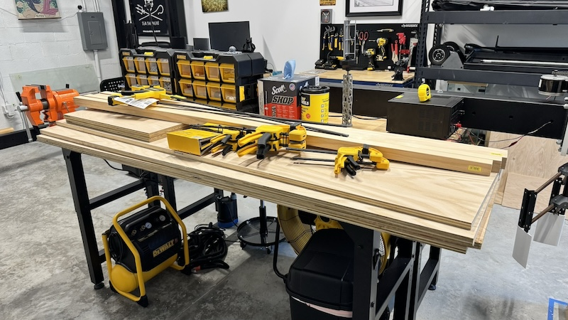
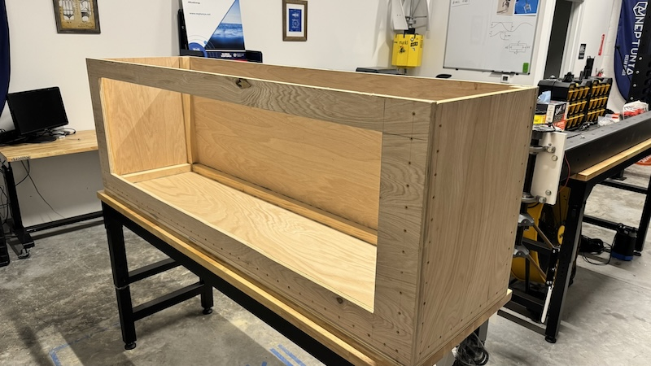

# Overview & 3D Model

### 3D visualization: [3D viewer](https://collaborate.shapr3d.com/v/NPVw5xXpwtwc81BRGQEVF)

### 3D models: inside [CAD & Schematics](https://github.com/neptunyalabs/wavetankOS/tree/main/design_files/cad%20%26%20schematics) folder, feel free to inspect and study its construction

# Tank Construction Sequence
### 1. Wood Work
- Start by purchasing wood material and supplies described in the BOM files, under [design_files](https://github.com/neptunyalabs/wavetankOS/tree/main/design_files) folder.

- Cut wood panels as laid out in 3D model file, under [CAD & Schematics](https://github.com/neptunyalabs/wavetankOS/tree/main/design_files/cad%20%26%20schematics) folder

### 2. Water Proofing

### 3. Window Install

### 4. Mooring Frame

### 5. Water Test

### 6. Final Product