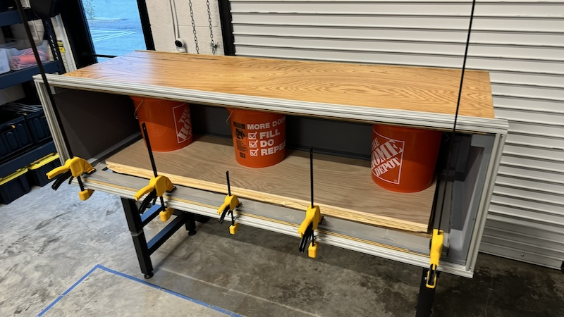

# Overview & 3D Model

### 3D visualization: [3D viewer](https://collaborate.shapr3d.com/v/NPVw5xXpwtwc81BRGQEVF)

### 3D models: inside [CAD & Schematics](https://github.com/neptunyalabs/wavetankOS/tree/main/design_files/cad%20%26%20schematics) folder, feel free to inspect and study its construction

# Tank Construction Sequence
## 1. Wood Work
- Start by purchasing wood material and supplies described in the BOM files, under [design_files](https://github.com/neptunyalabs/wavetankOS/tree/main/design_files) folder
- Cut wood panels as laid out in 3D model file, under [CAD & Schematics](https://github.com/neptunyalabs/wavetankOS/tree/main/design_files/cad%20%26%20schematics) folder

- Using Construction Adhesive glue wood panel corners to a hardwood square dowel
- Use 90 degree clamps to hold them in place
- Mark and insert wood deck screws, aligned on every 2 inches, pre-drill to avoid future cracks

## 2. Water Proofing
- Sand wood panels and mask tank edges
- Mix epoxy paint and hardener
- Paint the tank inside with waterproof epoxy paint
- Use fiberglass cloth over tank corners
> [!CAUTION]
> Perform waterproofing work on a well ventilated area

## 3. Window Install
- Using Construction Adhesive glue acrylic window to wood frame
- Use wood clamps to hold it in place while curing adhesive

- Seal window edges with high-grade silicone calk

## 4. 8020 Frame
- Pre-drill and attach 8020 aluminum frame with SS wood screws
- Start from the base frame, then attach upper supports

- Finish installing external 8020 frame, top & bottom

## 5. Water Test (wait at least 48h to fully cure)
- Now it's time to the first water test
- Fill-up the tank with water and inspect for issues at every stage
- Make some water movement tests
- Inspect the tank surroundings for any sign of leak

# Final Product

