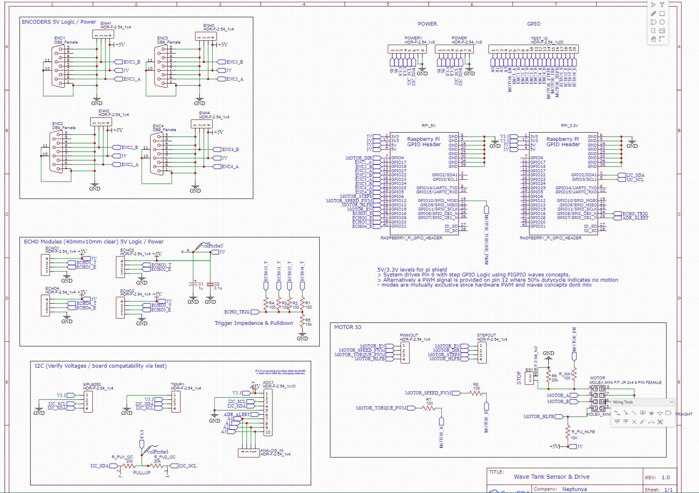
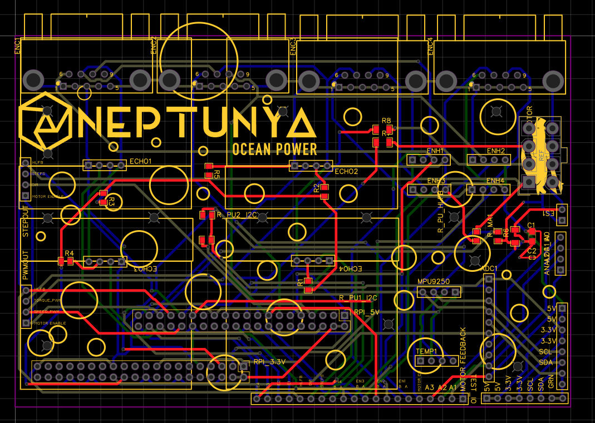
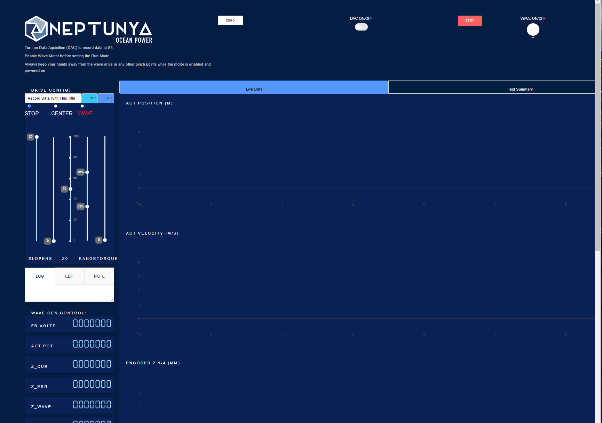

# Electronics Assembly


## Hardware Setup

### PCB Overview
the PCB acts as a connection between the raspberry pi and a number of peripheral sensors and actuators.
#TODO: connections & placement overview (photo)




## Linux Setup
1. Using the BOM below find the purchase & setup links for the raspberry pi and install ubuntu 20.04 or later
2. Once installed & booted, either log on remotely using SSH or using a mouse & keyboard then navigate to the home directory using `cd ~/`
3. Download the setup script to install all utilities 
```
curl https://raw.githubusercontent.com/neptunyalabs/wavetankOS/main/setup.sh -o wavetankOS_install.sh
```

4. Install wavetankOS, this will enable the wavetank service to start on startup. 
```
bash ~/wavetankOS_install.sh
```
5. If you'd like to use AWS S3 data logging you will need to configure your aws account by adding the account apikey and secret in the environmental variable section, or use another method that AWS provides with their BOTO3 CLI utility. Try running `aws configure` to get started.

Your wavetank dashboard will now be running here `http://<your_hostname>.local:8050/`

### Setting Up The Software:
Configuration of the software is handled through environmental variables, these can be edited for the wavetank service by editing the `/lib/systemd/system/wavetank.service` file on your raspberry pi

This example `service` created in a bash "one-liner" lists the environmental variable defaults
```
sudo bash -c '/bin/cat <<EOM >"/lib/systemd/system/wavetank.service"
[Unit]
WaveTankOS Firmware & Dashboard
[Service]
ExecStart=/home/$(whoami)/wavetankOS/waveware/fw_main.py
ExecStop=/bin/systemctl kill -s SIGKILL wavetank
Type=forking

#here are the potential enviornmental varables for your use
#Environment="WAVEWARE_LOG_S3=true"
#Environment="WAVEWARE_S3_BUCKET=custom_aws_bucket_name" 
#Environment="WAVEWARE_FLDR_NAME=v1" 
#Environment="WAVEWARE_PORT=8777"  #where to run the daq / control api
#Environment="FW_HOST=0.0.0.0"  #where to run the daq / control api
#Environment="WAVEWARE_VWAVE_DIRECT=true"  #control based on speed with correction
#Environment="WAVE_SPEED_DRIVE_MODE=pwm"  #use 'step','pwm','off','step-pwm' depending on your motor type

#Dashboard Customization
#Environment="WAVEWARE_DASH_GRAPH_UPT=3.3"
#Environment="WAVEWARE_DASH_READ_UPT=1.5"

#DAQ Rates
#Environment="WAVEWARE_POLL_RATE=0.033"
#Environment="WAVEWARE_POLL_TEMP=60"
#Environment="WAVEWARE_WINDOW=6" #wavelengths to show for buffer size

[Install]
WantedBy=multi-user.target

EOM'
```

Additionally you can change any one of these when running manually using instructions below.

##### Running Manually:
1. stop the wavetank service `sudo systemctl stop wavetank`
2. use `wavedash` to run the live dashboard
3. use `wavedaq` to run the data acquisition system and control system
4. use `wavepost` to run a post-processing system that downloads data from S3, use `wavepost -h` to determine options. Set the test-data download directory to `WAVEWARE_TESTDATA_FLDR` as the root, then to the `WAVEWARE_FLDR_NAME` of your test data, by default this will be `V1` and must match the data on S3 to be successful. 


### Using The Software:
While using a computer on the same network as the raspberry pi navigate to `http://<your_hostname>.local:8050/` in your browser of choice.

#### Dashboard Overview


##### Drive Config Section:
1. enable the motor controller with the `wave on/off` button
2. mode input sets the drive mode for the wave maker. Use the get/set buttons to apply changes or get the current state of the wavemaker drive.
3. Set the mode of operation, it is recommened to center first towards the `Zo` input that is a value of 1-100 between the `range` slider values.
4. set the wave height and slope `(wave length x0.5/ wave height)`
5. Using the clearpath PWM mode allows setting torque at right
6. At any time press the red stop button and the drive config will be set to stop. It is safter to use a power cutoff to the motor driver but this works as well.

##### Data Output:
1. encoder readouts can be zero'd by using the zero button. This is useful for ensuring zero is at some datum.
2. By turning on the DAQ with the slider data will start populating from the running daq application.
3. the readouts and positions on the graphs will update as your tests goes on and as long as the daq is on.
4. Finally the test-summary allows a review of all test-points run and their stats.

##### Logging / Customization & Test Notes:
1. The test-note function allows the recording to S3 of test-notes to help with recording intent of tests, or anomolies in the process, or record any other data that you want.
2. The edit tab allows safe setting & adjustment of control system parameters and other internal variables. This can be dangerous however restarting the process or device will fix any error.
3. Finally the log will display the feedback of the DAQ & Control system to give the user an idea of what is going on.

